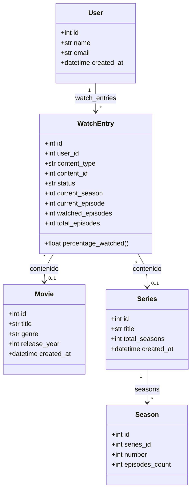

# WatchLog API - Proyecto Base (Flask Intermedio)

## Descripcion
WatchLog es un ejercicio de nivel intermedio con Flask inspirado en plataformas como Goodreads o MyAnimeList. El objetivo es que los alumnos creen una API REST para registrar peliculas y series, gestionar una watchlist y calcular el avance de cada usuario. Este repositorio contiene la base del proyecto: el esqueleto de configuracion, modelos y blueprints listos para completar.

## Objetivos de aprendizaje
- Practicar la arquitectura application factory de Flask.
- Utilizar SQLAlchemy y Flask-Migrate para modelar la base de datos y aplicar migraciones.
- Implementar operaciones CRUD y relaciones entre modelos.
- Calcular el porcentaje de avance de una serie en base a temporadas y episodios vistos.
- Simular autenticacion mediante el header `X-User-Id`.
- Diseñar respuestas consistentes (JSON) y manejar errores comunes.

## Estructura del proyecto
```
watchlog-api/
|-- app.py
|-- requirements.txt
|-- src/
    |-- __init__.py           # Application factory y registro de blueprints/extensiones
    |-- config.py             # Configuracion por entorno (dev, test, prod)
    |-- extensions.py         # Instancias compartidas (SQLAlchemy, Migrate)
    |-- api/
        |-- __init__.py       # Registro central de blueprints
        |-- health.py         # Ruta GET /health
        |-- movies.py         # Rutas CRUD para peliculas
        |-- series.py         # Rutas CRUD para series y temporadas
        |-- progress.py       # Rutas de watchlist y actualizacion de progreso
    |-- models/
        |-- __init__.py       # Exporta los modelos disponibles
        |-- movie.py          # Modelo Movie
        |-- series.py         # Modelo Series
        |-- seasons.py        # Modelo Season
        |-- user.py           # Modelo User
        |-- watch_entry.py    # Modelo WatchEntry (progreso del usuario)
```

Cada archivo contiene clases, metodos y funciones con `TODO` listos para completar. La idea es que los alumnos rellenen las piezas que faltan siguiendo las pistas indicadas.

## Flujo recomendado para los alumnos
1. **Configurar el entorno**: crear un entorno virtual, instalar dependencias y revisar las configuraciones en `src/config.py`.
2. **Diseñar la base de datos**: completar los modelos en `src/models/` y generar migraciones con Flask-Migrate.
3. **Completar la capa de servicios**: implementar la logica en las clases `MovieService`, `SeriesService` y `ProgressService`.
4. **Resolver las rutas**: reemplazar las respuestas `501` por respuestas reales utilizando la capa de servicios y modelos.
5. **Calcular el progreso**: implementar el metodo `percentage_watched` en `WatchEntry` y exponerlo en los endpoints necesarios.
6. **Validar y documentar**: probar los endpoints con Postman o Thunder Client y dejar evidencia de las pruebas.

## Configuracion rapida
```bash
git clone <url-del-repo>
cd watchlog-api
python -m venv venv
venv\Scripts\activate  # Windows
pip install -r requirements.txt

# Crear base de datos (una vez configurados los modelos)
flask db init
flask db migrate -m "init"
flask db upgrade

# Ejecutar la API
flask run
```

Variables de entorno sugeridas (archivo `.env`):
```
FLASK_APP=app.py
FLASK_ENV=development
SQLALCHEMY_DATABASE_URI=sqlite:///instance/app.db
```

## Blueprints y endpoints previstos
| Blueprint | Endpoint | Metodo | Descripcion |
|-----------|----------|--------|-------------|
| health    | `/health/` | GET | Verifica el estado de la API. |
| movies    | `/movies/` | GET, POST | Listado y creacion de peliculas. |
| movies    | `/movies/<id>` | GET, PUT, DELETE | Operaciones sobre una pelicula. |
| series    | `/series/` | GET, POST | Listado y creacion de series. |
| series    | `/series/<id>` | GET, PUT, DELETE | Operaciones sobre una serie. |
| series    | `/series/<id>/seasons` | POST | Alta de temporadas para una serie. |
| progress  | `/watchlist/movies/<movie_id>` | POST | Agrega una pelicula a la watchlist. |
| progress  | `/watchlist/series/<series_id>` | POST | Agrega una serie a la watchlist. |
| progress  | `/progress/series/<series_id>` | PATCH | Actualiza el avance de una serie. |
| progress  | `/me/watchlist` | GET | Lista la watchlist del usuario. |

> Nota: Los endpoints retornan respuestas `501 Not Implemented` hasta que se complete la logica.

## TODO principal por archivo
- `src/api/health.py`: reemplazar el check basico por validaciones reales (BD, cache, servicios externos).
- `src/api/movies.py`: implementar `MovieService` y conectar los endpoints con los modelos.
- `src/api/series.py`: manejar relacion serie-temporadas y exponer datos normalizados.
- `src/api/progress.py`: validar el header `X-User-Id`, gestionar la watchlist y calcular porcentajes.
- `src/models/movie.py`: definir columnas y relacion con `WatchEntry`.
- `src/models/series.py`: definir columnas, relacion con `Season` y helper `to_dict`.
- `src/models/seasons.py`: crear columnas de temporada y relacion con `Series`.
- `src/models/user.py`: modelar el usuario y su relacion con `WatchEntry`.
- `src/models/watch_entry.py`: manejar llaves foraneas, estado (`status`), calculo `percentage_watched` y metodos helpers.

## Calculo de avance sugerido
```python
percentage = (watched_episodes / total_episodes) * 100 if total_episodes else 0
```
- Limitar `watched_episodes` a un maximo de `total_episodes`.
- Retornar `0` cuando no existan episodios vistos.
- Retornar `100` cuando el contenido este marcado como completado.

## Evaluacion sugerida
| Criterio | Peso |
|----------|------|
| CRUDs funcionales y migraciones correctas | 40% |
| Calculo de progreso y consistencia de datos | 25% |
| Validaciones y manejo de errores | 20% |
| Codigo limpio, documentacion y buenas practicas | 15% |

## Consejos finales
- Implementar primero los modelos.
- Reutilizar logica de servicios en las rutas para mantener una sola fuente de verdad.
- Usar `flask shell` para explorar los modelos mientras se desarrolla.

## Diagrama de clases (Mermaid)

